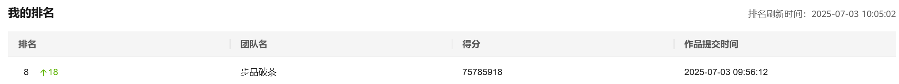

# light-chaser-HUAWEI2025
本仓库为 华为云嵌入式软件大赛 2025 ·「追光者」 赛题项目仓库，涵盖初赛、复赛等阶段的完整开发过程与相关资料。
This repository contains the project for the Huawei Cloud Embedded Software Contest 2025 · "Light Chaser", including the full development workflow and resources for both the preliminary and final rounds.

官方网址[2025华为嵌入式软件大赛·追光者(算法组-京津东北赛区)_华为云开发者大赛平台_华为云](https://developer.huaweicloud.com/competition/information/1300000108/)

本次赛事目前采用C++开发

## 初赛 Preliminary Round

优化两版，详见

[code1.0v](./preliminary/src/1.0/)  

[code1.0.2v](./preliminary/src/1.0.2_highest/)  

## 复赛  Semifinal

将于7.19举行，目前未知线上or线下。总之当天会直接比赛+结果
